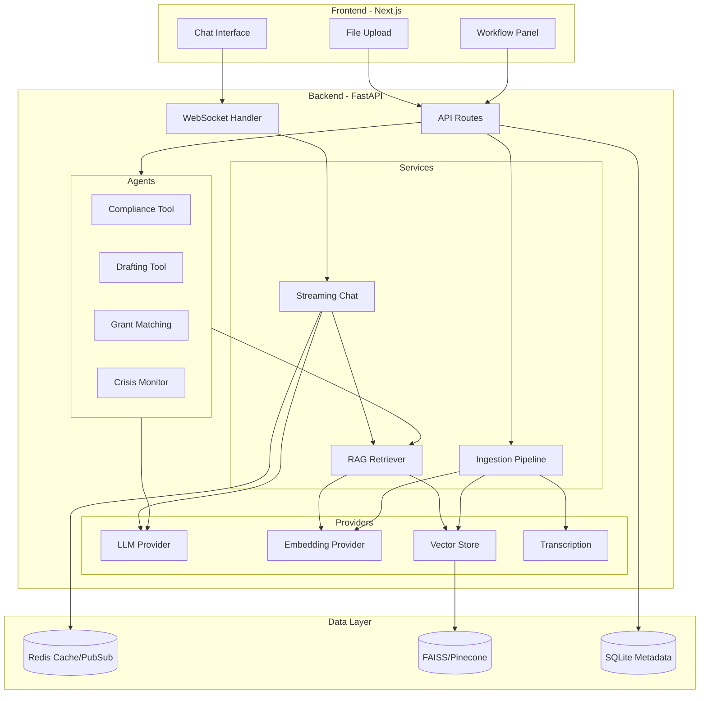

# AidOps AI

**AI-Native Automation Platform for Humanitarian Operations**

An autonomous agent platform that ingests messy, unstructured humanitarian data (PDFs, audio, spreadsheets), indexes it into a vector database, and executes automated workflows from natural-language prompts — returning streamed, source-cited answers.

[](https://github.com/JuniorDieka/aidops-ai/actions)
[](https://opensource.org/licenses/MIT)
[](https://www.python.org/downloads/)
[](https://nodejs.org/)
[](https://fastapi.tiangolo.com/)
[](https://nextjs.org/)
[](https://www.docker.com/)

---

## 🎯 Value Proposition

AidOps AI demonstrates production-grade agentic AI system design for humanitarian operations:

- **Multimodal RAG**: Ingest PDFs, audio transcripts, and spreadsheets with citation-grounded retrieval
- **Autonomous Agents**: LangChain-powered workflows for compliance checks, report drafting, grant matching, and crisis monitoring
- **Streaming Architecture**: Real-time WebSocket responses with Redis pub/sub for background tasks
- **Demo Mode**: Zero API keys required — runs end-to-end with local models and mock providers
- **Production Ready**: Observability, evaluation harness, Docker deployment, CI/CD pipeline

---

## 🏗️ Architecture



---

## ✨ Features

### 🔄 Multimodal Ingestion Pipeline
- **PDF Processing**: Extract text with page-level metadata using PyMuPDF
- **Audio Transcription**: Local faster-whisper or OpenAI Whisper API
- **Spreadsheet Parsing**: CSV/XLSX with pandas, preserving structure
- **Chunking Strategy**: Recursive character splitting with 500-token chunks, 50-token overlap
- **Embedding**: Local sentence-transformers or OpenAI embeddings
- **Vector Storage**: FAISS (demo) or Pinecone (production) with metadata filtering

### 💬 RAG Chat with Citations
- **Streaming Responses**: Token-by-token streaming over WebSocket
- **Source Citations**: Every answer includes clickable citations with file name, page, and relevance score
- **Context Grounding**: Refuses to answer when context is insufficient
- **Multilingual Support**: Language detection and metadata tagging
- **Session Management**: Redis-backed chat history with conversation context

### 🤖 Autonomous Agent Workflows

**Compliance Cross-Reference**
- Compare operational data against global standards (UN SDG, Sphere Standards)
- Identify gaps and compliance issues
- Generate actionable recommendations

**Report/Grant Drafting**
- Transform raw field notes into structured reports
- Apply donor-specific templates
- Include proper citations and formatting

**Grant Matching**
- Query funding opportunities (mocked or real APIs)
- Match project descriptions to grant criteria
- Generate proposal outlines

**Crisis Alert Monitor**
- Background polling of news/weather feeds
- Proactive alerts pushed to chat stream
- Severity classification and routing

### 🎨 Modern Frontend
- **Next.js 14** with App Router and TypeScript
- **Tailwind CSS** for responsive, mobile-first design
- **Real-time Updates**: WebSocket connection with automatic reconnection
- **Citation UI**: Expandable citation chips with full source details
- **File Upload**: Drag-and-drop with progress tracking
- **Workflow Triggers**: One-click agent execution with result display

### 📊 Observability & Evaluation
- **Structured Logging**: JSON logs with request tracing
- **LLM Tracing**: LangSmith-compatible instrumentation
- **Token Tracking**: Cost estimation per request
- **Evaluation Harness**: Automated RAG quality metrics
  - Faithfulness score
  - Citation correctness
  - Retrieval hit-rate
  - Source relevance

---

## 🚀 Quick Start

### Demo Mode (No API Keys Required)

**Current Status:** ✅ Fully functional demo mode with local models and mock providers

```bash
# Clone the repository
git clone https://github.com/JuniorDieka/aidops-ai.git
cd aidops-ai

# Start with Docker Compose (Recommended)
docker-compose -f infra/docker-compose.yml up -d

# Or run locally (Hybrid approach for faster development)
# Terminal 1 - Backend & Redis (Docker)
docker-compose -f infra/docker-compose.yml up backend redis -d

# Terminal 2 - Frontend (Local)
cd frontend
npm install
npm run dev
```

**Access the application:**
- Frontend: http://localhost:3000
- Backend API: http://localhost:8000
- API Docs: http://localhost:8000/docs

**Load sample data:**
```bash
# Via API
curl -X POST http://localhost:8000/api/ingest-sample-data

# Or use the "Load Sample Data" button in the UI
```

**What works in demo mode:**
- ✅ PDF, CSV, and spreadsheet ingestion
- ✅ Vector search with FAISS
- ✅ Local sentence-transformers embeddings
- ✅ Mock LLM responses (simulated AI answers)
- ✅ WebSocket streaming chat
- ✅ Citation tracking and display
- ✅ Sample data with budget templates

**Known limitations:**
- Audio transcription uses mock provider (faster-whisper not included in demo)
- LLM responses are simulated (configure OpenAI/Anthropic for real AI)

### Production Mode (With API Keys)

1. **Copy environment files:**
```bash
cp backend/.env.example backend/.env
cp frontend/.env.example frontend/.env
```

2. **Configure API keys in `backend/.env`:**
```bash
# LLM Provider
LLM_PROVIDER=openai  # or anthropic
OPENAI_API_KEY=your-key-here

# Embeddings
EMBEDDING_PROVIDER=openai
OPENAI_EMBEDDING_MODEL=text-embedding-3-small

# Vector Database
VECTOR_DB_PROVIDER=pinecone
PINECONE_API_KEY=your-key-here
PINECONE_ENVIRONMENT=your-env
PINECONE_INDEX_NAME=aidops-ai

# Optional: Observability
LANGSMITH_API_KEY=your-key-here
```

3. **Start services:**
```bash
docker-compose -f infra/docker-compose.yml up -d
```

---

## 📋 Environment Variables

| Variable | Required | Default | Description |
|----------|----------|---------|-------------|
| `LLM_PROVIDER` | No | `mock` | `openai`, `anthropic`, or `mock` |
| `OPENAI_API_KEY` | For OpenAI | - | OpenAI API key |
| `ANTHROPIC_API_KEY` | For Anthropic | - | Anthropic API key |
| `EMBEDDING_PROVIDER` | No | `local` | `openai` or `local` |
| `VECTOR_DB_PROVIDER` | No | `faiss` | `pinecone`, `faiss`, or `chroma` |
| `PINECONE_API_KEY` | For Pinecone | - | Pinecone API key |
| `REDIS_HOST` | No | `localhost` | Redis host |
| `REDIS_PORT` | No | `6379` | Redis port |
| `ENABLE_TRACING` | No | `true` | Enable LangSmith tracing |
| `LANGSMITH_API_KEY` | For tracing | - | LangSmith API key |

See `backend/.env.example` for complete list.

---

## 🧪 Testing

### Backend Tests
```bash
cd backend

# Run all tests
pytest tests/ -v

# Run with coverage
pytest tests/ --cov=app --cov-report=html

# Run specific test file
pytest tests/unit/test_ingestion.py -v
```

### Frontend Tests
```bash
cd frontend

# Run tests
npm test

# Type checking
npm run type-check

# Linting
npm run lint
```

### Evaluation Harness
```bash
cd backend
python -m evals.run_evals
```

**Sample Output:**
```
AidOps AI - RAG Evaluation Harness
================================================================================

Test Case tc001: factual_retrieval
Query: What are the Sphere minimum standards for water supply?
✓ PASSED
  Faithfulness: 1.00
  Source Hit: True
  Citations: 3
  Avg Relevance: 0.87

================================================================================
EVALUATION SUMMARY
================================================================================
Total Test Cases: 5
Passed: 4
Failed: 1
Success Rate: 80.0%
```

---

## 🛠️ Development

### Code Quality
```bash
# Backend
cd backend
ruff check .              # Linting
black .                   # Formatting
mypy app/                 # Type checking

# Frontend
cd frontend
npm run lint              # ESLint
npm run format            # Prettier
npm run type-check        # TypeScript
```

### Pre-commit Hooks
```bash
pip install pre-commit
pre-commit install
```

---

## 📦 Deployment

### Docker Deployment
```bash
# Build and start all services
docker-compose -f infra/docker-compose.yml up -d

# View logs
docker-compose -f infra/docker-compose.yml logs -f

# Stop services
docker-compose -f infra/docker-compose.yml down
```

### Manual Deployment

**Backend:**
```bash
cd backend
pip install -r requirements.txt
uvicorn app.main:app --host 0.0.0.0 --port 8000 --workers 4
```

**Frontend:**
```bash
cd frontend
npm install
npm run build
npm start
```

---

## 🎓 What This Demonstrates

### For Technical Reviewers

**Agentic AI Architecture:**
- Provider abstraction pattern for swappable LLM/embedding/vector DB implementations
- LangChain agents with custom tools and function calling
- Async-first design with proper error handling and retry logic

**RAG Best Practices:**
- Semantic chunking with overlap for context preservation
- Metadata filtering for targeted retrieval
- Citation tracking with source grounding
- Hybrid search capability (semantic + keyword)

**Production Concerns:**
- Structured logging with request tracing
- Token/cost tracking and observability
- Automated evaluation harness for quality metrics
- Input validation and prompt injection mitigation
- PII detection and handling

**Engineering Quality:**
- Clean layered architecture (API → Services → Core → Providers)
- Dependency injection for testability
- Comprehensive test coverage (unit + integration)
- Type safety with Pydantic v2 and TypeScript strict mode
- CI/CD pipeline with linting, type-checking, and tests

**Streaming & Real-time:**
- WebSocket streaming with backpressure handling
- Redis pub/sub for background task → client communication
- Graceful reconnection and error recovery

---

## 📊 User Flow

```
User Chat → FastAPI WebSocket → Vector Context Search → LangChain Agent/LLM → Streamed Answer + Citations
     ↓                                      ↓                      ↓
File Upload → Ingestion Pipeline → Chunking + Embedding → Vector DB Storage
     ↓
Workflow Trigger → Agent Tool Execution → Context Retrieval → LLM Reasoning → Structured Output
```

---

## 🤝 Contributing

See [CONTRIBUTING.md](CONTRIBUTING.md) for development guidelines.

---

## 📄 License

This project is licensed under the MIT License - see the [LICENSE](LICENSE) file for details.

---

## 🙏 Acknowledgments

- **Sphere Project** for humanitarian standards
- **UN SDGs** for development goals framework
- **LangChain** for agent orchestration
- **FastAPI** for async Python web framework
- **Next.js** for React framework

---

## 📞 Support

For questions or issues:
- Open an issue on GitHub
- Email: support@aidops-ai.example.com

---

**Built with ❤️ for humanitarian operations teams worldwide**
