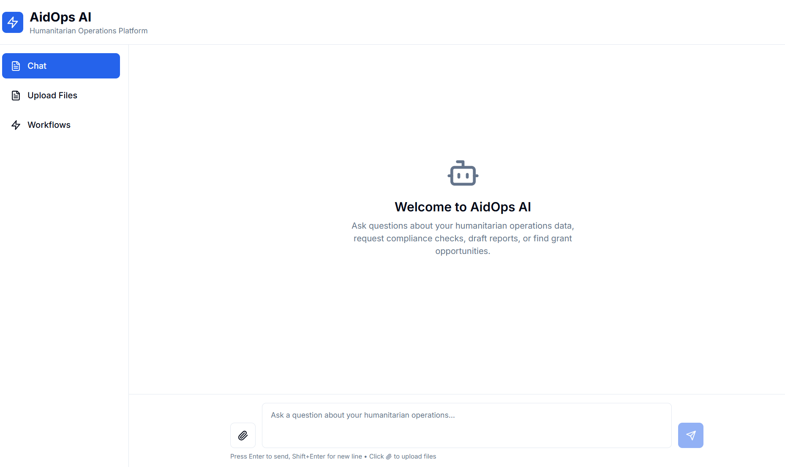
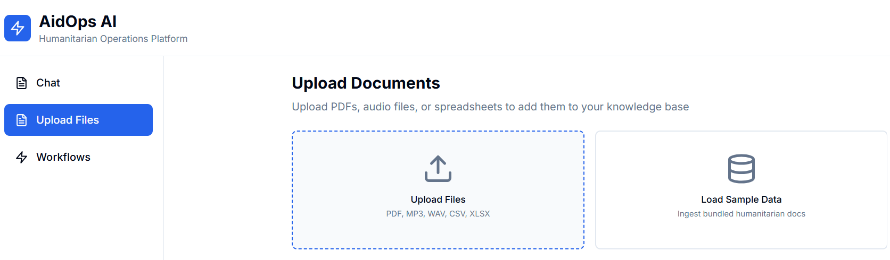
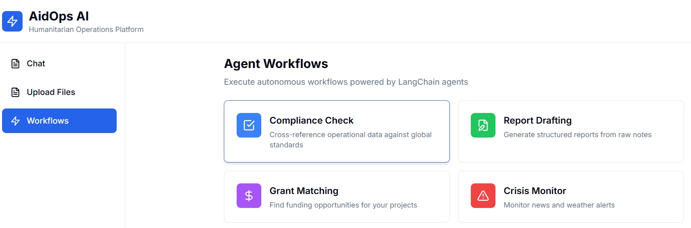

# AidOps AI

> **AI-powered assistant for humanitarian operations** — Upload documents, ask questions, automate workflows.

Transform messy operational data (PDFs, spreadsheets, audio) into actionable insights with AI-powered chat, automated compliance checks, and intelligent report generation.

[](https://github.com/JuniorDieka/aidops-ai/actions)
[](https://opensource.org/licenses/MIT)
[](https://www.python.org/downloads/)
[](https://nodejs.org/)
[](https://fastapi.tiangolo.com/)
[](https://nextjs.org/)
[](https://www.docker.com/)

---

## 📸 See It In Action

<div align="center">

### 💬 Chat Interface

*Ask questions about your data in plain English — get instant answers with sources*

### 📤 Upload Documents  

*Drag & drop PDFs, spreadsheets, or audio files — AI extracts and indexes everything*

### 🤖 Automated Workflows

*One-click compliance checks, report drafting, grant matching, and crisis alerts*

</div>

> 📁 [View all screenshots](docs/screenshots/) with detailed feature descriptions

---

## ✨ What It Does

### For Program Managers & Field Staff
- 💬 **Ask questions** about your operational data in natural language
- 📄 **Upload any document** — PDFs, spreadsheets, meeting recordings
- 🔍 **Get instant answers** with citations showing exactly where info came from
- ✅ **Automate compliance** checks against UN SDG and Sphere Standards
- 📝 **Generate reports** from raw field notes using donor templates
- 🎯 **Match grants** to your project descriptions automatically

### For Technical Teams
- 🧠 **RAG Architecture** — Vector search with FAISS/Pinecone + LangChain agents
- 🔄 **Real-time Streaming** — WebSocket chat with token-by-token responses
- 🎨 **Modern Stack** — FastAPI backend + Next.js frontend + Redis + Docker
- 🧪 **Demo Mode** — Works locally without API keys (uses mock LLM)
- 🚀 **Production Ready** — Observability, testing, CI/CD, evaluation harness

## 🏗️ How It Works

```
📄 Upload Document → 🔍 AI Extracts & Indexes → 💬 Ask Questions → 🎯 Get Cited Answers
                                                      ↓
                                              🤖 Trigger Workflows
```

**Tech Stack:**
- **Frontend:** Next.js 14 + TypeScript + Tailwind CSS
- **Backend:** FastAPI + Python 3.11
- **AI:** LangChain agents + OpenAI/Anthropic (or local models)
- **Data:** Redis + FAISS/Pinecone vector DB
- **Deploy:** Docker Compose

## 🚀 Quick Start

### Option 1: Try Demo (No Setup Required)

```bash
# Clone and run with Docker
git clone https://github.com/JuniorDieka/aidops-ai.git
cd aidops-ai
docker-compose -f infra/docker-compose.yml up -d
```

**Then open:** http://localhost:3000

✅ **Works without API keys** — Uses local AI models for demo  
✅ **Sample data included** — Click "Load Sample Data" to try it  
✅ **Full features** — Chat, upload, citations (workflows need API keys)

### Option 2: Production Setup (With Real AI)

1. **Add API keys to `backend/.env`:**
   ```bash
   cp backend/.env.example backend/.env
   # Edit .env and add:
   OPENAI_API_KEY=your-key-here
   LLM_PROVIDER=openai
   ```

2. **Start services:**
   ```bash
   docker-compose -f infra/docker-compose.yml up -d
   ```

**Supported AI Providers:**
- OpenAI (GPT-4, GPT-3.5)
- Anthropic (Claude)
- Local models (demo mode)

## ⚙️ Configuration

**Key Environment Variables** (in `backend/.env`):

| Variable | Default | Description |
|----------|---------|-------------|
| `LLM_PROVIDER` | `mock` | AI provider: `openai`, `anthropic`, or `mock` |
| `OPENAI_API_KEY` | - | Your OpenAI API key |
| `VECTOR_DB_PROVIDER` | `faiss` | Vector DB: `faiss` (local) or `pinecone` (cloud) |
| `REDIS_HOST` | `localhost` | Redis server (use `redis` in Docker) |

📄 See [`backend/.env.example`](backend/.env.example) for all options

---

## 🧪 Development

### Run Tests
```bash
# Backend
cd backend && pytest tests/ -v

# Frontend  
cd frontend && npm test
```

### Code Quality
```bash
# Backend linting
cd backend && ruff check . && black .

# Frontend linting
cd frontend && npm run lint
```

### View Logs
```bash
docker-compose -f infra/docker-compose.yml logs -f
```

## 🎓 Technical Highlights

**For Engineers & Technical Reviewers:**

### Architecture Patterns
- ✅ **Provider abstraction** — Swap LLM/vector DB/embeddings without code changes
- ✅ **Async-first design** — FastAPI + WebSocket streaming
- ✅ **Clean layers** — API → Services → Core → Providers
- ✅ **Type safety** — Pydantic v2 + TypeScript strict mode

### AI/ML Best Practices  
- ✅ **RAG with citations** — Every answer cites source documents
- ✅ **LangChain agents** — Custom tools for compliance, drafting, grants
- ✅ **Semantic chunking** — 500-token chunks with 50-token overlap
- ✅ **Hybrid search** — Vector similarity + metadata filtering

### Production Ready
- ✅ **Observability** — Structured logging, LangSmith tracing, token tracking
- ✅ **Testing** — Unit + integration tests, evaluation harness
- ✅ **CI/CD** — GitHub Actions with linting, type-checking, tests
- ✅ **Security** — Input validation, PII detection, prompt injection mitigation

---

## 📄 License

MIT License — See [LICENSE](LICENSE) file

---

## � Contact

**Questions or feedback?**
- 📧 Email: jnrdieka@gmail.com
- � Issues: [GitHub Issues](https://github.com/JuniorDieka/aidops-ai/issues)

---

<div align="center">

**Built with ❤️ for humanitarian operations teams worldwide**

*Powered by LangChain • FastAPI • Next.js*

</div>
